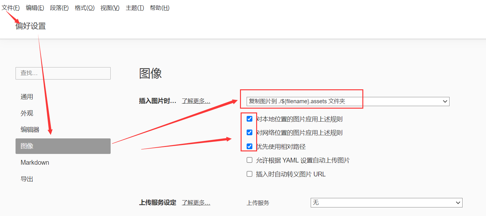
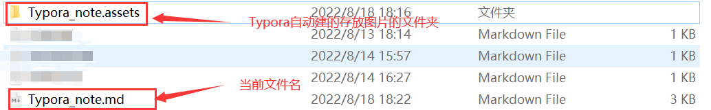

## 用Typora软件编写的Markdown文件上传到github图片丢失问题

Typora是一个很不错的Markdown编辑器。但是在笔记中添加图片相对麻烦。特别是没有设置图片的默认存储路径时，移动md文件或者上传到github上会造成图片丢失。今天在把一个笔记上传到github上时，突然发现

`img src=" "`路径格式的图片没有丢失，探索之后发现这是一个好的方法，但是在操作过程中会增加一点工作量。具体操作如下：

### 把文件存储路径改为相对路径

因为Markdown文件时纯文本文件，因此所以用户无法在 Markdown 文件中直接插入图片文件，而是通过在 Markdown 文件中引用文件路径或者 URL 的方式插入图片，所以默认情况下，Typora 会先将文件保存到一个固定的目录，具体什么目录跟操作系统有关。这里先随便截个图插入到当前文档：

点击图片可以发现该图片默认存放在`C:\Users\HP\AppData\Roaming\Typora\typora-user-images\image-20220818180018215.png`下。当你在本机内移动该本md文档时，图片还是能正常显示，因为并没有改变文档的位置。但是当你把本文档分享给别人或者上传到自己的github上时，图片无法显示，因为图片是在你自己的电脑上保存着，别人的电脑上没有也就无法显示。

这时，我们可以把保存图片的路径改为相对路径。在Typora中，文件----->偏好设置----->图像。按下图箭头指示修改。

修改完成后当向Typora中插入图片时Typora会自动在该md文件当前目录下新建一个 `  当前文件名.asset`文件夹，用来存放插入该文档的图片。

插入图片的路径就变成了 `Typora_note.assets/image-20220818181610709.png`

这时在分享该文档时可以把md文件和存放图片的文件夹打包成一个文件，注意保持相对路径正确，也就是md文件和   .asset文件夹要保持在同一级目录下。如果只是单纯的分享给别人看，在文件---->导出---->PDF更方便。

### 上传到Gitbub的图片设置

就算使用了相对路径，文件还是在本地，相对路径也只是在系统文件管理下的路径。上传到github上面图片路径依然会实现。你当然也可以导出为pdf然后再上传，但是后面想修改的话可就难了。

网上有很多用服务器或者插件上传到图集的方法，太麻烦了，还需要联网。我今天发现的方法相当于弯道超车了。

